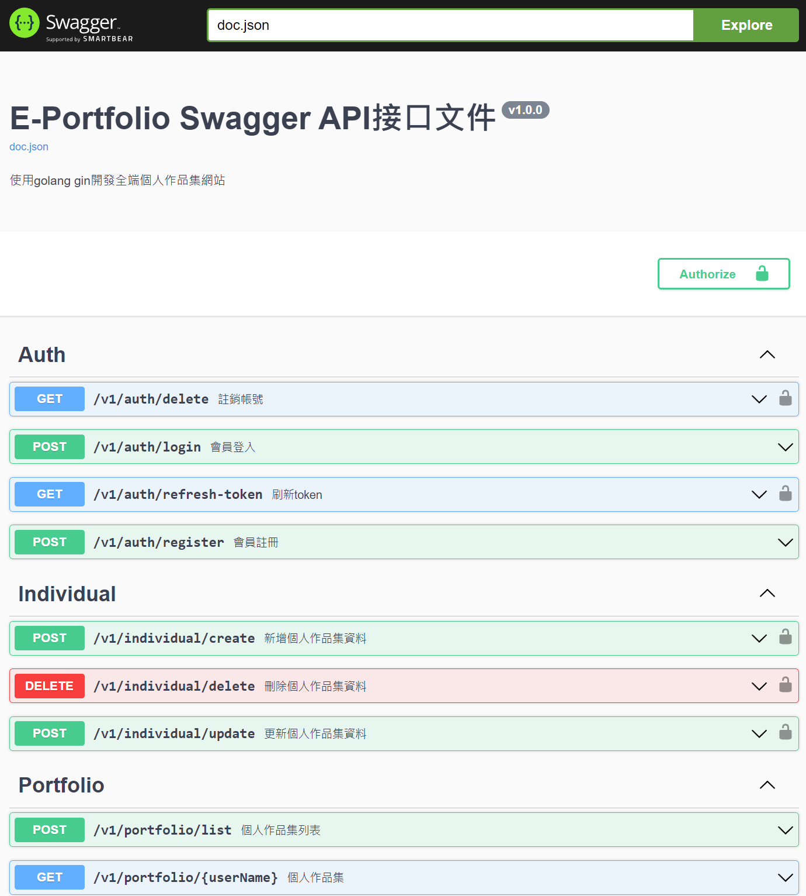
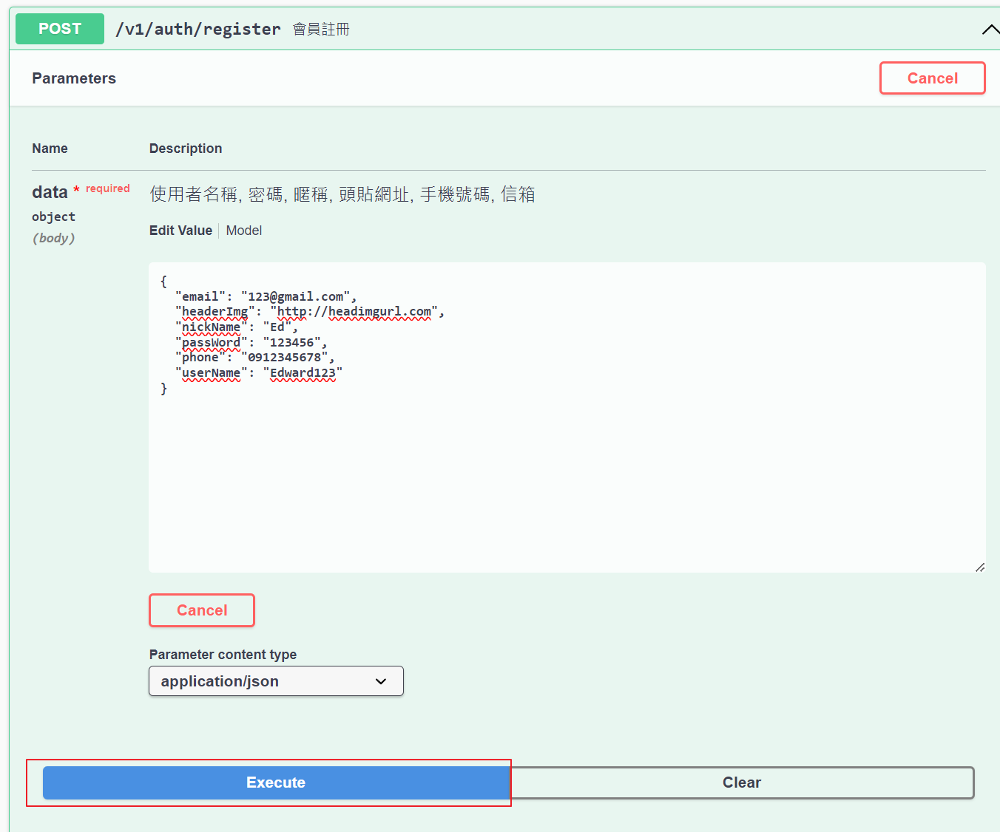
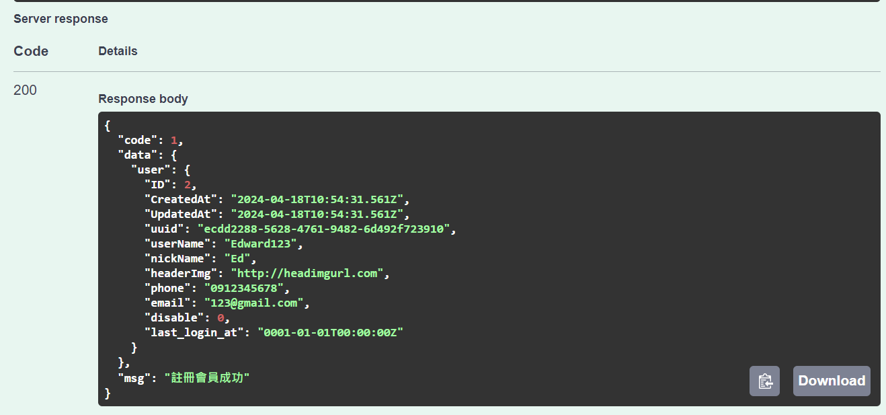

# e-portfolio-server

e-portfolio-server

# Demo project

1. 下載專案 (Clone project)

```
git clone https://github.com/zc17375/e-portfolio-server.git
```

2. 執行 docer compose (exec docker compose)

```
docker compose up -d
```

3. 打開 swagger api 文件網址 (run swagger api)

```
http://127.0.0.1:8888/swagger/index.html
```

4. 測試 API 功能 (test api function)

    

5. 範例 (For Example)

    

    

# Install related Dependency packages

```
# HTTP WEB 框架
go get -u github.com/gin-gonic/gin

# DB ORM
go get -u gorm.io/gorm
go get -u gorm.io/driver/mysql

# 設置配置
go get github.com/spf13/viper

# LOG日誌配置
go get -u go.uber.org/zap
go get github.com/lestrrat-go/file-rotatelogs // 輪換日誌

# SWAGGER 文件配置
go get -u github.com/swaggo/swag/cmd/swag
go get -u github.com/swaggo/gin-swagger
go get -u github.com/swaggo/files

# UUID
go get github.com/google/uuid

# JWT
go get github.com/golang-jwt/jwt/v5

# MONGODB
go get go.mongodb.org/mongo-driver/mongo


```
