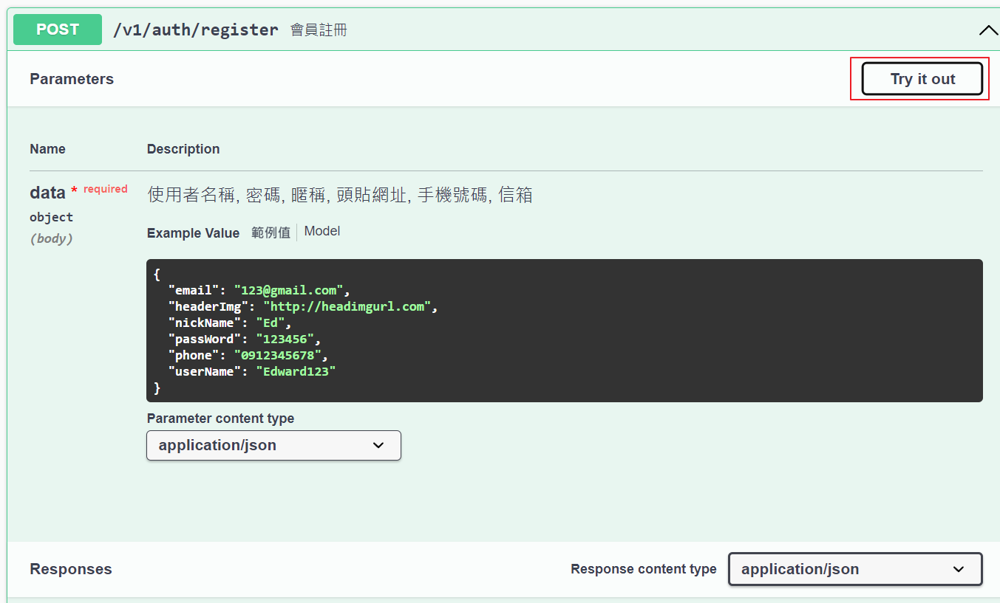

# <center>e-portfolio-server</center>

e-portolio-server 是純後端專案，使用Ｇolang gin框架 + GORM + Mysql & MongoDB 實現 Restful API  
並使用dockerfile & compose 容器化，未來將部署到ＧＣＰ上

* 主要技術：
    - JWT Auth
    - GORM mysql CRUD
    - MongoDB CRUD
    - API Document：Swagger
    - Log System：zap
    - env management：Viper


# 目錄結構
```
│  config.yaml
│  docker-compose.yml
│  Dockerfile
│  go.mod
│  go.sum
│  LICENSE
│  local_config.yaml
│  main.go
├─api
│  └─v1
│      └─controller  # API 版本管控
│
├─cmd
│  └─internal  # Server啟動相關
│
├─config  # 相關環境設定:db、jwt、cors、zap
│
├─docs  # swagger 自動生成文件
│
├─global  # 定義全域變數
│
├─initialize  # 定義初始化參數 router、db
│  └─internal
├─middleware  # jwt驗證、Cors
├─model  # 商業模型 API會用到的商業模型
│  ├─common
│  ├─request
│  └─response
├─router  # 定義路由
├─service  # API 商業邏輯
└─utils  # 常用工具 加解密、型態轉換
```

# Demo project
1. 下載專案 (Clone project)

```
git clone https://github.com/zc17375/e-portfolio-server.git
```

2. 下載相關package包
```
go mod tidy
```

3. 執行 docer compose (exec docker compose)

```
docker compose up -d
```

4. 打開 swagger api 文件網址 (run swagger api)

```
http://127.0.0.1:8888/swagger/index.html
```

5. 測試 API 功能 (test api function)

    

6. 範例 (For Example)

    點擊 Try it out

    

    點擊 Execute

    

    

# Install related Dependency packages

```
# HTTP WEB 框架
go get -u github.com/gin-gonic/gin

# DB ORM
go get -u gorm.io/gorm
go get -u gorm.io/driver/mysql

# 設置配置
go get github.com/spf13/viper

# LOG日誌配置
go get -u go.uber.org/zap
go get github.com/lestrrat-go/file-rotatelogs // 輪換日誌

# SWAGGER 文件配置
go get -u github.com/swaggo/swag/cmd/swag
go get -u github.com/swaggo/gin-swagger
go get -u github.com/swaggo/files

# UUID
go get github.com/google/uuid

# JWT
go get github.com/golang-jwt/jwt/v5

# MONGODB
go get go.mongodb.org/mongo-driver/mongo


```
